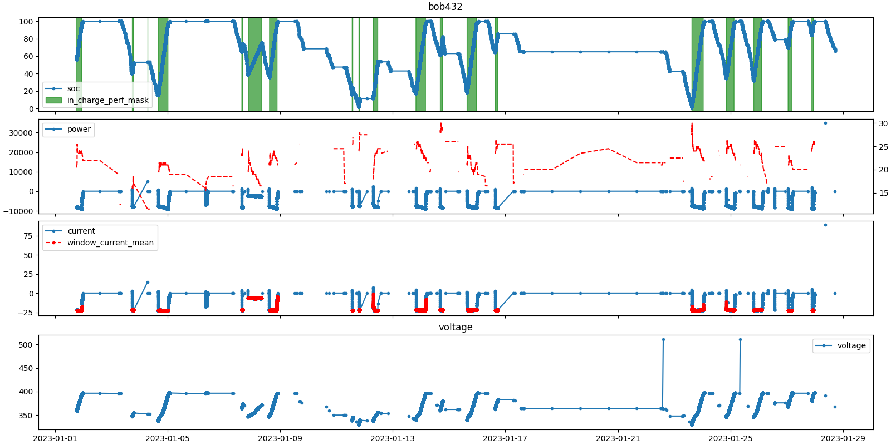

# EV data analysis package

### Context:
The goal of this package is to handle every step of the data analytics service of Bib:
- data extraction
- data analysis
- data valorization

## Hierarchy of code base:
```
.
└── src
    ├── core
    ├── tesla
    └── watea
```
### Core:
`core` contains the code that is common to any data provider.
```
core
├── console_utils.py
├── caching_utils.py
├── constants.py
├── perf_agg_processing.py
├── plt_utils.py
└── time_series_processing.py
```
- `console_utils`: 
    Provides a `parse_args` function which converts the arguments passed to the script as a dict of primitives. 
    This is used to make the scripts modular without having to comment/comment out pieces of code.
- `caching_utils`:
    Abstract the implementation of caching operations away from data provider specific code.
- `perf_agg_processing`:
    Implements operation common to the data provider sub packages of period performances such as charging and motion periods.
- `time_series_processing`:
    Implements operation common to the data provider sub packages of time series such as charging and motion periods.  
The other modules are pretty self explanatory.

### Data provider sub packages:
The code specific to a certain data provider is put in a separate folder.
Each sub package (except `core`) has the following scripts (where XX is the name of the data provider):
```
.
├── data_cache
│   ├── fleet_info
│   ├── processed_time_series
│   └── raw_time_series
├── plt_XX.py
├── processed_XX_ts.py
├── raw_XX_ts.py
├── XX_constants.py
├── XX_fleet_info.py
└── XX_perfs.py
```
- `raw_XX_ts`:  
    - Handles the extraction of raw time series.
    - Implements a `raw_ts_of` function which returns a DF of a specific battery as provided by the data provider.
    - extracts the fleet's raw data when called as a script.
- `XX_fleet_info`:
    - Computes a fleet_info dataframe which represents the profile of the fleet and its caching.
    - Each row corresponds to a vehicle and each row corresponds to a static property (e.g: `has_enough_data_to_compute_soh`).
    - Implements a `iterate_over_id/vin` iterator.
    - Computes the fleet_info_df when called as a script.
- `processed_XX_ts`: 
    - handles the processing of the raw time series and caching of the processed_time_series.
    - Implements a `raw_ts_of` function which returns a fully processed DF of a specific battery.
    - Implements a `iterate_over_processed_ts` on top of `XX_fleet_info.iterate_over_id/vin`.
    - Processes the raw_time_series of the fleet and caches the results when called as a script.
- `XX_constants`:
    - Holds the constants specific to that data provider.
- `XX_perfs`:
    - Computes the periodic performances of the vehicle such as trip/motion, charging performances.
    - Computes the performances of the fleet when called as a script.
- `plt_XX`:
    - Script to plot (ideally) any data computed by the other modules.
    - To use it:  
        1.  Write the layout of the plot you want to visualize as a dictionarry:  
            The keys can be `vehicle_df` to plot time series data or `perfs` and then a nested dict with the name of the performance as keys.   
            The values of the dict must be an array (even if you only want to plot one variable).    
            The values of this array can be a:
            - `string` with three cases: 
                - the string is a numerical var, and will be plotted with markers
                - the `string == "twinx"` the subsequent variales of that array to plot will be plotted in a twin of the current ax.
                - the string is a boolean var and will be plotted as a mask.
            - `dict` with key-values `y:var_to_plot`, `kind:kind_of_plot`, and other key-value pairs that will be passed as `kwargs` to the dataframe's `plot` method.
                This is great if you want to set a specific color, transparancy, ect...    
            or a nested array of the above, in which case the values of the nested array will be plotted in the same `Axes`.  
            Hence the use of `twinx` when the variables have different scales.  

        1.  Call `plt_XX.py` in the command line.  
            You have multiple command line arguments to specify to make the script as modular as possible:  
            - mandatory:  
                `--plt_id` to specify what data you want to plot:
                - `first`: plots data of the first vehicle in `flett_info` 
                - `all`: plots all vehicles one at a time, just close the current plot and the next one will be created.
                - `fleet`: Fills the plots with the data of the entire fleet.
            - `--plt_layout`: name of the layout as declared in the `XX_constants.py` module.
            - optional:
                - `--x_col`: `date` or `odometer`, or other columns in the procesed time series that will serve as the x argument when plotting.  
                This allows the user to view the relation betweem different variables.
                - `fleet_query`: query string passed to `fleet_info_df.query` before iterating on it to ignore certain vehicles.
                - `vehicle_query`: query string passed to `vehicle_df.query` before plotting its data.

        Examples:
        ```python
            IN_CHARGE_AND_POWER = {
                "vehicle_df": [
                    ["soc", "in_charge_perf_mask"],
                    [
                        "power",
                        "twinx",
                        {"y":"temp", "color":"red", "linestyle":"--"}
                    ],
                    [
                        "current",
                        {"y":"window_current_mean", "color":"red", "linestyle":"--", "marker":"."}
                    ],
                        "voltage",
                ],
            }
        ```
    ```shell
        python3 plt_watea.py --plt_layout="IN_CHARGE_AND_POWER" --plt_id="bob452" --x_col="date" --fleet_query="has_power_during_charge"
    ```
    Result:
    

#### Data caches
Most of the `data_cache` sub folders will be created automatically.  
The only one that you need to set up is the one used by `raw_XX_ts` to create the raw time series tables.  
In the case of watea, this is `bib_export` and the folders corresponding to the vehicles.  
Then you should be able to run any script and the data that it depends on should be generated if it is not yet cached.  

---
## Watea:
To setup watea data, you must:
1. Download the zip file `bib_export` from the google drive into `data_cache`.
1. Unzip `bib_export` and then run in `src/watea` `setup_raw_ts.sh`.
